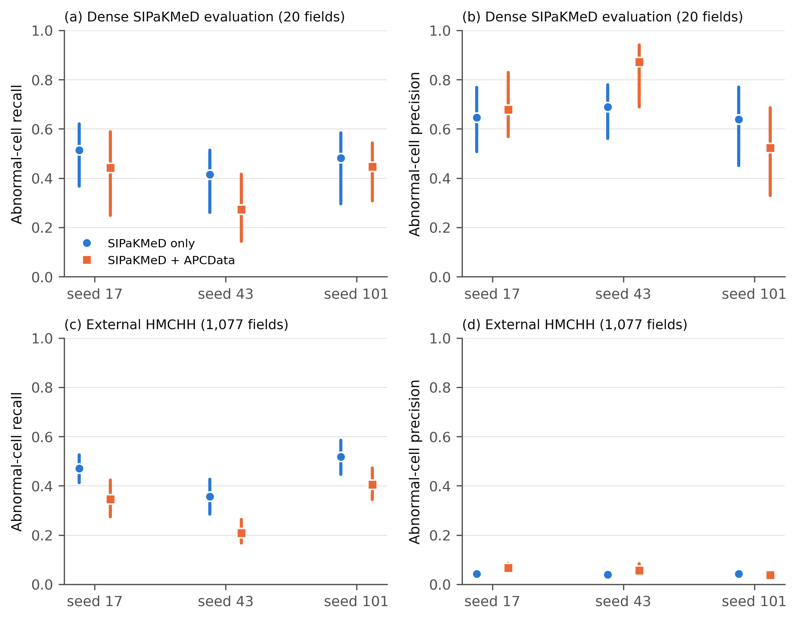

# Hidden field overlap, incomplete reference annotation and label conversion errors in cervical-cell detection: a retrospective multi-source study with external evaluation

Abu Suraih Sakhri

Corresponding author: Abu Suraih Sakhri (abusuraihsakhri@gmail.com)

Word count (main text): 3,900 (Introduction to Conclusions, excluding tables and legends) · Figures: 4 · Tables: 3 · Supplementary material: 1 file

\pagebreak

## Abstract

**Background.** Public cervical cytology image collections make detectors easy to train, but how those detectors are evaluated can change the conclusions drawn from them. We measured three sources of evaluation error (hidden duplication of microscope fields, incomplete reference annotation and label conversion) and then compared single-source with two-source training under a protocol that corrected them.

**Methods.** We trained YOLOv8n detectors on a public SIPaKMeD derivative alone or with APCData, using three seeds each. Fields were matched exhaustively for shared image content with keypoint matching and photometric confirmation, and splits were built from the resulting overlap components. Forty SIPaKMeD fields were densely re-annotated (1,067 cells) by one reviewer starting from model proposals, withheld from training, and divided by component into development and evaluation sets. Thresholds and calibration were fitted on development fields only. External evaluation used 1,077 HMCHH fields with a reference rebuilt from the source XML to include abnormal cells only. Uncertainty was estimated by cluster bootstrap.

**Results.** Matching found 791 overlapping field pairs; 421 were invisible to thumbnail correlation. A filename-grouped split would have placed 10 of 20 evaluation fields in overlap with fields in other partitions. The earlier HMCHH conversion had labelled 332 organism and flora annotations as abnormal cells and dropped 119 abnormal-cell annotations, which understated external recall by 2.9–6.7 points. On the dense evaluation fields, single-source models detected 41.5–51.3% of 224 abnormal cells at 63.9–68.9% precision; combined-source models detected 27.2–44.6%. On HMCHH, abnormal recall was 20.8–51.8% and abnormal precision 3.8–6.7% for all models, and adding APCData lowered recall in every seed (−11.3 to −14.9 points). Scored against the public sparse labels instead of the dense reference, the same predictions showed 20.4–45.7% instead of 52.4–87.1% abnormal precision, and 62.7–86.3% instead of 27.2–51.3% recall.

**Conclusions.** Sparse reference labels and a class-mapping error changed evaluation results by more than the differences between training configurations, field duplication contaminated half of a filename-grouped evaluation set, and a label conversion error biased external recall. Adding a second training source improved performance on that source but not on held-out or external data. Detection studies on public cytology data should report how field independence was established, how complete the reference is, and how labels were converted.

**Keywords:** cervical cytology; Pap smear; object detection; data leakage; annotation completeness; external validation; YOLO

\pagebreak

## Introduction

Cervical cancer remained among the most common cancers in women worldwide in 2022 [1], and the World Health Organization strategy for its elimination relies on scaled screening [2]. Cytology screening depends on trained readers finding a small number of abnormal squamous cells among many normal ones, reported in Bethesda System categories [3]. Automated detection of candidate abnormal cells is an attractive aid, and public image collections have made such models easy to train. SIPaKMeD provides cluster images of five cell morphologies [4], APCData provides liquid-based fields annotated with Bethesda categories [5], and the HMCHH-TCT collection provides thousands of fields with abnormal-cell annotations [6,7]. Other public resources address classification and segmentation [8,9], and detection and classification models have been reported on several of them [10–12].

Three measurement problems can make such models look better or worse than they are, independent of architecture. First, derived dataset releases can contain the same physical microscope field more than once, shifted or refocused and filed under different image identifiers. Splits built from filenames then place the same cells on both sides of a train–test boundary. This is a form of data leakage [13], and duplicated or near-duplicated images are a recognized pitfall in medical imaging [14]. Second, cytology images are often annotated sparsely: only some cells in a field carry boxes. When a detector finds an unannotated cell, the evaluation counts a false positive, so precision measured against sparse labels describes the annotation as much as the model. Label errors in test sets are known to distort benchmark conclusions [15]. Third, converting annotations between formats requires mapping source categories onto the target task. A conversion that assumes a single category, or that maps numeric class indices without checking their names, silently changes the reference standard.

We encountered all three problems while developing a lightweight detector under a 6 GB graphics-memory budget, and an internal audit of our first analysis found that class-index and grouping errors had changed its headline comparisons. This report therefore treats measurement as the object of study. We ask how much each problem affects detector evaluation, and, after correcting them, what a single-source and a two-source training set achieve on a withheld densely annotated set and on an external dataset from a different laboratory. We do not propose a new architecture, and we make no claim of clinical readiness.

## Methods

### Study design and reporting

This is a retrospective study of public, de-identified image datasets. No patients were recruited and no new images were acquired. Reporting follows the TRIPOD+AI [16] and CLAIM 2024 [17] items that apply to a retrospective detection study; the completed checklist is in Supplementary Table S5. The evaluation protocol, including field assignments, threshold-selection rule, calibration method and bootstrap settings, was written to a hash-locked file before any model in the final analysis was trained. Training was blocked in code until that file existed.

### Data sources

**SIPaKMeD.** The original resource contains 966 cluster images with 4,049 annotated cells in five morphological classes [4]. We used a publicly redistributed derivative (Roboflow export, "mirror A") containing 1,298 fields with polygon annotations. It is not identical to the original release: it contains additional fields, including crops whose filenames carry source coordinates. Fields without a canonical SIPaKMeD identifier (340) were excluded from training because their provenance could not be reconstructed. The five classes were mapped to a binary task by name: dyskeratotic and koilocytotic cells as abnormal; metaplastic, parabasal and superficial–intermediate cells as normal.

**APCData.** The source record describes 425 liquid-based cytology fields from 73 studies, annotated with six Bethesda categories [5]. Eight images have no annotation file in the release and were not used. Of the 417 annotated fields, five carried no recoverable specimen code and were excluded. NILM was mapped to normal and ASC-US, ASC-H, LSIL, HSIL and SCC to abnormal.

**HMCHH-TCT-CellDet.** This collection contains 8,037 images from 129 slides, annotated for abnormal cells [6,7]. It was used only for external evaluation, never for training, threshold selection or calibration. We used the 1,077 fields of a previously prepared validation subset. Filename prefixes, which identify the source slide, served as clustering units (116 prefixes).

### Reference standards

**Dense SIPaKMeD reference.** Public SIPaKMeD annotations mark only some cells in each field. To obtain a more complete reference, 40 fields were sampled from the original validation partition and every cell was annotated in Label Studio, starting from model proposals (an earlier detector at confidence 0.05). The reviewer was instructed to correct classes and boxes, delete false proposals and add missed cells. Compared with the proposals, the exported annotations contain 689 unchanged boxes, 32 changed boxes, 346 added boxes and 17 deletions, for 1,067 cells (706 normal, 361 abnormal); the original sparse labels on the same fields contained 197 boxes. Review was performed and attested by a single reviewer. Reviewer credentials and review timestamps were not captured by the export, and there was no independent second review. Because the proposals came from a model, the reference may be anchored toward model behavior; we treat it as a more complete, model-assisted reference, not an expert gold standard.

**HMCHH external reference.** The source annotations are XML files with rectangles and polygons in several categories. Besides abnormal cells (异常), they label Trichomonas, shift in flora and Actinomyces. We rebuilt the reference from the XML, keeping every item labelled abnormal (rectangles, and polygons converted to their bounding boxes) and excluding organism and flora categories. Five abnormal-cell annotations stored as single points had no extent and were excluded. The resulting reference contains 1,837 abnormal cells in 1,077 fields (61 fields contain none).

### Detection of overlapping fields and split construction

Filename grouping was insufficient for SIPaKMeD because re-captures of one physical field appear under different image numbers. We therefore tested the 1,715 SIPaKMeD and APCData fields for shared content. Every pair of fields from the same source was matched (1,019,514 pairs). Pairs across the two sources were matched only when the maximum normalized cross-correlation over all circular shifts between 64 × 48 grayscale thumbnails exceeded 0.35. Matching used ORB keypoints [18] (3,000 per image at 1,024 px width, Lowe ratio 0.75) and a similarity transform fitted with RANSAC [19] (reprojection threshold 6 px). A pair was declared overlapping when the fit had at least 20 inliers, an inlier ratio of at least 0.70 and a scale between 0.8 and 1.25, or when thumbnail correlation was at least 0.97. The thresholds were calibrated on seven visually confirmed overlaps and 60 random pairs. Two further choices followed from calibration runs (Section S2). The scale constraint was added because static sensor and optics artifacts produced degenerate fits (scale near zero) between unrelated fields, including fields from different datasets. Within-source matching was made exhaustive because correlation screens at 0.45 and then 0.35 kept finding true partial overlaps at their lower bound. Every confirmed pair was then checked photometrically: the second field was warped onto the first and pixel correlation was measured inside the shared region. Pair lists and scores are released with the code.

Fields were grouped into connected components joining filename groups (SIPaKMeD field identifier; APCData specimen code), confirmed overlaps and exact byte duplicates. Every component containing one of the 40 dense fields was withheld from training, validation and test. The remaining components were stratified by source and majority class and assigned by a seeded shuffle to training (70%), validation (15%) and test (15%). The dense fields were divided at component level into a development set, used only for threshold selection and calibration fitting, and an evaluation set, used once for reporting. Dense fields of unresolved provenance were placed in development. This gave 20 development fields (8 of unresolved provenance; 485 cells, 137 abnormal; 18 components) and 20 evaluation fields (582 cells, 224 abnormal; 19 components).

### Models and training

We trained YOLOv8n [20] (3.0 million parameters) initialized from the COCO-pretrained detection checkpoint [21], using Ultralytics 8.4.31 and PyTorch 2.10 on one NVIDIA RTX 3060 Laptop GPU (6 GB). Two training sets were compared: SIPaKMeD only, and SIPaKMeD plus APCData. Each was trained with three explicitly different seeds (17, 43, 101) under an identical budget: input size 640, batch 16, up to 150 epochs with early stopping after 30 epochs without improvement, mixed precision, deterministic mode, and Ultralytics default augmentation (mosaic, HSV jitter, horizontal flip, translation, scale, random erasing). The optimizer setting "auto" resolved to AdamW (learning rate 0.001667, momentum 0.9, weight decay 0.0005) in every run. The checkpoint with the best validation fitness (mAP50-95, the installed version's criterion) was retained. Validation fields came from the component-disjoint validation split, never from the dense set.

### Evaluation

All models were run once per image at confidence 0.01, NMS IoU 0.7 and up to 300 detections. A prediction matched a reference box at IoU ≥ 0.5, greedily in descending confidence order [22]. Localization metrics ignore class. The abnormal-cell metrics match abnormal predictions to abnormal reference boxes only.

For each model, the operating threshold was the value from 0.01 to 0.65 (step 0.01) that maximized abnormal-cell F1 on the dense development fields, with ties resolved to the lower threshold. That threshold was then applied unchanged to the dense evaluation fields, the sparse held-out test sets and HMCHH. The primary endpoint was abnormal-cell recall on the dense evaluation fields, reported with abnormal-cell precision and unmatched abnormal predictions per field. External performance on HMCHH was a secondary endpoint. APCData and SIPaKMeD sparse test results are reported descriptively, because missing annotations make their precision a lower bound.

### Calibration

For each model, temperature scaling [23] was fitted by minimizing binary negative log-likelihood of detection correctness on the dense development fields and evaluated on the dense evaluation fields. We report expected calibration error (10 bins), Brier score and negative log-likelihood. Detector calibration is conditional on emitted candidates and says nothing about missed cells [24].

### Statistical analysis

Uncertainty was estimated with a percentile bootstrap [25] of 1,000 resamples (seed 20260921), resampling clusters rather than cells: overlap components for the dense and sparse sets, slide prefixes for HMCHH. Intervals are conditional on the trained models and do not include training variability. Training variability is shown separately as the mean, standard deviation and range over three seeds. Source comparisons are paired: within each seed, the combined-source model minus the single-source model, on the same fields and the same bootstrap draws. We did not adjust for multiplicity and report intervals rather than significance tests.

### Secondary and sensitivity analyses

**Reference completeness (post hoc).** On the dense evaluation fields, the same predictions and thresholds were scored against the original sparse labels and against the dense reference. This analysis was added after the protocol was frozen and is descriptive.

**Earlier HMCHH conversion (post hoc).** The same HMCHH predictions and thresholds were also scored against the earlier converted reference, to measure the effect of the conversion error. This analysis is descriptive.

**Stain normalization.** Reinhard color transfer [26] was applied at inference time using three disjoint reference sets of 50 training fields, selected by seeded shuffle before evaluation. Thresholds were not retuned. We report paired changes in abnormal-cell recall and precision on the dense evaluation fields and the APCData test set. Stain normalization is one of several approaches to color variation [27–29]; we tested only this one.

### Corrections to earlier analyses

An internal audit of our earlier analysis identified errors that changed its conclusions, including class-index mapping, overlapping source fields across splits, same-data threshold selection, an incorrect calibration gradient and unsupported claims. Those results are withdrawn. Supplementary Section S1 lists each error, its effect and its correction.

## Results

### Field overlap and final splits

Exhaustive within-source matching of 1,019,514 field pairs confirmed 791 overlapping pairs: 783 within SIPaKMeD, 8 within APCData and none across sources. In 790 of them, pixel correlation inside the shared region was at least 0.945 after alignment; the remaining pair was confirmed by its filename coordinates. Of the 791 pairs, 421 had thumbnail correlation below 0.35 and would have been missed by any of the correlation screens we tried first. Joining filename groups through these overlaps merged 199 of them and gave 840 components (759 SIPaKMeD, 81 APCData). Of these, 187 held more than one field, and the largest held 29.

The overlaps would have compromised a filename-grouped split. In the split we built first on filename groups alone, 148 overlapping pairs crossed partitions, and 10 of its 20 dense evaluation fields overlapped a field elsewhere, 12 of those pairs with training fields. In the final split, no confirmed overlap, exact duplicate or near-duplicate crosses partitions, and no component containing a dense field was used for training. The automated release verification passed all 29 checks. Table 1 gives the resulting data sets and Figure 1 the study flow.

**Table 1.** Data sources and field counts after exclusions. Counts are fields (microscope images).

| Source | Role | Train | Validation | Test | Excluded | Grouping unit |
|---|---|---|---|---|---|---|
| SIPaKMeD (Roboflow derivative) | Training/validation/test | 634 | 123 | 140 | 340 | Field name + image-overlap component |
| SIPaKMeD dense subset | Threshold development / evaluation |  | 20 | 20 |  | Overlap component (withheld from training) |
| APCData | Training/validation/test (combined variant) | 317 | 50 | 45 | 5 | Specimen code + image-overlap component |
| HMCHH-TCT-CellDet | External evaluation only |  |  | 1077 |  | Filename slide prefix |

### Training

All six runs used the same optimizer settings and stopped early, after 85 to 98 epochs, with best checkpoints at epochs 55 to 68 (validation mAP50-95 0.417–0.436). The validation sets differ between the two training sets, so these values are not comparable across them.

### Primary endpoint: dense SIPaKMeD evaluation fields

Development-selected thresholds varied from 0.02 to 0.18 across the six models (Table 2). For two models the F1 optimum was sharp, a single threshold; for the others, thresholds up to 0.09 apart gave development F1 within 0.01 of the maximum. On the 20 evaluation fields (224 abnormal and 358 normal reference cells), single-source models detected 41.5% to 51.3% of abnormal cells (mean 47.0%, SD 5.0 across seeds; Supplementary Table S6) at abnormal precision of 63.9% to 68.9%. Combined-source models detected 27.2% to 44.6% (mean 38.7%, SD 9.9) at precision 52.4% to 87.1% (Figure 2a–b). Every model missed at least 109 of the 224 abnormal cells. Unmatched abnormal predictions ranged from 0.45 to 4.55 per field. Bootstrap intervals were wide, spanning about 20 to 30 percentage points for recall, reflecting 19 clusters.

Within each seed, the combined-source model had lower abnormal recall than the single-source model: −7.1 points (95% CI −19.0 to 4.5), −14.3 (−20.8 to −4.0) and −3.6 (−12.3 to 6.9) (Table 3). Differences in precision had no consistent direction (+3.2, +18.3 and −11.5 points). Part of this pattern follows from the thresholds. The combined-source model for seed 43 was assigned the highest threshold (0.18), which gave it the lowest recall and the highest precision.

**Table 2.** Abnormal-cell detection at the development-selected threshold. Intervals are 95% cluster-bootstrap intervals conditional on the trained model (19 overlap components for the dense set; 116 slide clusters for HMCHH). HMCHH precision is a lower bound because normal cells are not annotated. Localization metrics and F1 are in the supplementary tables.

| Evaluation | Training data | Seed | Threshold | Abnormal TP/reference | Abnormal recall % (95% CI) | Abnormal precision % (95% CI) | Unmatched abnormal predictions per field (95% CI) |
|---|---|---|---|---|---|---|---|
| Dense SIPaKMeD | SIPaKMeD only | 17 | 0.06 | 115/224 | 51.3 (36.8–62.0) | 64.6 (50.7–76.8) | 3.15 (1.26–5.60) |
| Dense SIPaKMeD | SIPaKMeD only | 43 | 0.14 | 93/224 | 41.5 (26.0–51.3) | 68.9 (56.1–77.9) | 2.10 (0.85–3.68) |
| Dense SIPaKMeD | SIPaKMeD only | 101 | 0.09 | 108/224 | 48.2 (29.6–58.4) | 63.9 (45.1–76.9) | 3.05 (1.11–5.43) |
| Dense SIPaKMeD | SIPaKMeD + APCData | 17 | 0.08 | 99/224 | 44.2 (24.8–58.9) | 67.8 (56.9–83.0) | 2.35 (0.50–4.85) |
| Dense SIPaKMeD | SIPaKMeD + APCData | 43 | 0.18 | 61/224 | 27.2 (14.3–41.7) | 87.1 (69.0–94.1) | 0.45 (0.16–0.78) |
| Dense SIPaKMeD | SIPaKMeD + APCData | 101 | 0.02 | 100/224 | 44.6 (30.9–54.3) | 52.4 (32.9–68.6) | 4.55 (1.79–7.92) |
| HMCHH external | SIPaKMeD only | 17 | 0.06 | 865/1837 | 47.1 (41.3–52.5) | 4.3 (3.4–5.4) | 17.85 (14.48–21.87) |
| HMCHH external | SIPaKMeD only | 43 | 0.14 | 656/1837 | 35.7 (28.4–42.7) | 3.9 (2.9–5.2) | 15.09 (10.70–20.07) |
| HMCHH external | SIPaKMeD only | 101 | 0.09 | 952/1837 | 51.8 (44.7–58.5) | 4.3 (3.4–5.2) | 19.74 (16.32–23.53) |
| HMCHH external | SIPaKMeD + APCData | 17 | 0.08 | 634/1837 | 34.5 (27.4–42.3) | 6.7 (5.4–8.6) | 8.18 (5.87–10.59) |
| HMCHH external | SIPaKMeD + APCData | 43 | 0.18 | 382/1837 | 20.8 (16.8–26.4) | 5.6 (4.0–8.4) | 5.99 (3.72–8.49) |
| HMCHH external | SIPaKMeD + APCData | 101 | 0.02 | 744/1837 | 40.5 (34.4–47.3) | 3.8 (2.8–5.3) | 17.32 (12.42–23.01) |

### External evaluation: HMCHH

On the 1,077 HMCHH fields (1,837 abnormal cells, 116 slide clusters), abnormal-cell recall was 35.7% to 51.8% for single-source models and 20.8% to 40.5% for combined-source models. Abnormal precision was 3.8% to 6.7% for all six models, with 6.0 to 19.7 unmatched abnormal predictions per field (Figure 2c–d). Class-agnostic localization recall was 50.5% to 68.8%, but localization precision was only 1.5% to 2.8%. Because HMCHH annotates abnormal cells only, predictions on normal cells count as unmatched, so these precisions are lower bounds on true precision. Even so, at the development-selected thresholds none of the models produced a usable ratio of correct to incorrect abnormal detections on this dataset.

In all three seeds, the combined-source model detected fewer HMCHH abnormal cells than its single-source pair: −12.6 (−17.3 to −7.0), −14.9 (−21.1 to −9.1) and −11.3 (−18.3 to −4.2) points. It produced fewer unmatched abnormal predictions in two seeds (−9.7 and −9.1 per field) and had slightly higher precision in the same two seeds (+2.4 and +1.7 points) (Table 3).

**Table 3.** Paired difference, combined-source minus single-source model, within each seed, on the same fields and bootstrap draws. Recall and precision in percentage points; unmatched predictions per field in counts. Not adjusted for multiplicity.

| Seed | Evaluation | Δ abnormal recall (95% CI) | Δ abnormal precision (95% CI) | Δ unmatched abnormal predictions per field (95% CI) | Clusters |
|---|---|---|---|---|---|
| 17 | Dense SIPaKMeD | −7.1 (−19.0 to 4.5) | 3.2 (−6.1 to 22.0) | −0.80 (−2.35 to 0.95) | 19 |
| 17 | HMCHH external | −12.6 (−17.3 to −7.0) | 2.4 (1.7–3.6) | −9.66 (−11.97 to −7.57) | 116 |
| 43 | Dense SIPaKMeD | −14.3 (−20.8 to −4.0) | 18.3 (7.7–25.4) | −1.65 (−3.16 to −0.50) | 19 |
| 43 | HMCHH external | −14.9 (−21.1 to −9.1) | 1.7 (0.6–4.0) | −9.10 (−12.45 to −6.38) | 116 |
| 101 | Dense SIPaKMeD | −3.6 (−12.3 to 6.9) | −11.5 (−21.5 to 0.1) | 1.50 (−0.74 to 3.87) | 19 |
| 101 | HMCHH external | −11.3 (−18.3 to −4.2) | −0.5 (−1.2 to 0.6) | −2.42 (−5.83 to 1.44) | 116 |

### Held-out tests with sparse labels

On the SIPaKMeD held-out test (140 fields, 277 annotated abnormal cells), abnormal recall was 69.3% to 83.0% for all models, with precision against the sparse labels of 14.5% to 28.7% (Supplementary Table S2). On the APCData held-out test (45 fields, 174 annotated abnormal cells), single-source models detected 13.8% to 23.0% of annotated abnormal cells, and combined-source models 67.2% to 77.6%. Adding APCData to training therefore improved detection on held-out APCData fields, a source it had been trained on. It did not improve detection on SIPaKMeD evaluation fields or on the external dataset.

### Effect of reference completeness (post hoc)

On the 20 dense evaluation fields, the public sparse labels mark 117 of the 582 cells in the dense reference (20.1%) and 51 of the 224 abnormal cells (22.8%). Scoring the same predictions at the same thresholds against the sparse labels changed both metrics substantially (Figure 3; Supplementary Table S3). Abnormal precision fell from 52.4–87.1% against the dense reference to 20.4–45.7% against sparse labels, and localization precision from 53.2–85.2% to 15.9–34.6%. Abnormal recall rose, from 27.2–51.3% to 62.7–86.3%. The sparse labels appear to favor cells that the models also find easily. Evaluated against sparse labels, every model would have appeared to have better sensitivity and much worse precision than it had.

### Effect of the earlier HMCHH conversion (post hoc)

The earlier converted reference contained 2,054 boxes for the same 1,077 fields, compared with 1,837 abnormal cells in the rebuilt reference. Scored against it, the same predictions at the same thresholds had abnormal recall 2.9 to 6.7 points lower than against the corrected reference (for example 41.1% versus 47.1% for the seed-17 single-source model), while abnormal precision differed by at most 0.2 points.

### Calibration

Raw detection confidences were underconfident: candidates were correct more often than their scores implied (Supplementary Figure S1). Fitted temperatures ranged from 1.89 to 2.52. On the evaluation fields, temperature scaling reduced expected calibration error from 0.167–0.233 to 0.113–0.140, Brier score from 0.174–0.228 to 0.158–0.194 and negative log-likelihood from 0.553–0.752 to 0.481–0.571 (Supplementary Table S4). Calibration remained imperfect after scaling, and these values describe emitted candidates only.

### Stain normalization

Reinhard normalization reduced abnormal-cell recall in 34 of 36 combinations of model, reference set and dataset, and never increased it by more than 0.6 points (Figure 4; Supplementary Table S7). On dense evaluation fields, recall fell by 6.7 to 19.2 points. On the APCData test, it fell by 35.1 to 53.4 points for combined-source models, while for single-source models, which detected few APCData abnormal cells to begin with, it changed by −8.6 to +0.6 points. Results were similar across the three reference sets. The thresholds were not retuned after normalization, and a retuned threshold might recover part of the loss; the analysis shows only that this transform, applied at inference, did not help these models.

## Discussion

This study set out to measure evaluation error and then to compare training sources under a corrected protocol. The measurement problems turned out to be large relative to the model differences. A second training source helped on held-out fields from that source, which is expected. It did not help on held-out SIPaKMeD fields or on an external dataset, where it lowered abnormal-cell recall in every seed while reducing unmatched predictions. The combined-source models were more conservative, not better. External performance was poor for all models: abnormal precision below 7% means that fewer than one in fourteen flagged cells matched an annotated abnormal cell. Even allowing for missing normal-cell annotations, this is far from a usable screening aid, and it is consistent with the domain shift reported between cytology laboratories and preparations [12,29].

Threshold selection on 20 development fields was unstable. The six models received thresholds from 0.02 to 0.18, and on several of them a wide range of thresholds gave almost the same development F1. Differences between models at these thresholds therefore partly reflect where each threshold landed, as the seed-43 combined-source model shows. Operating points chosen on a small development set should be reported with this uncertainty, and comparisons across models are more robust over a range of thresholds than at a single selected point.

**Field overlap is a property of the data, not of a split.** The redistributed SIPaKMeD derivative contains many re-captures of the same physical field, shifted or refocused and filed under unrelated identifiers, sometimes under different class prefixes. No filename rule could have found them. Exact hashing found none, and a perceptual hash found only the single near-identical pair that started this investigation. Our first corrected split, built on filename groups, looked independent by every conventional check and still placed the same cells in training and evaluation. Image-content matching was necessary, and correlation screening alone missed partial overlaps. We recommend that detection studies built on public cytology collections report how field independence was established, and release the overlap evidence along with the split.

**Label conversion changes the reference standard.** The HMCHH conversion error came from a reasonable-looking shortcut: sampling 200 annotation files, seeing one category, and mapping every rectangle to it. The full files also contain organisms and flora, and some abnormal cells are drawn as polygons or single points. The earlier reference counted 332 organism boxes as abnormal cells and omitted 119 abnormal annotations. Scoring the same predictions against the earlier reference understated abnormal recall by 2.9 to 6.7 points; precision changed little, probably because matches gained on organism boxes and matches lost on missing polygons partly offset each other. Any study reusing a converted copy of such a dataset should check category counts and geometry types against the source. The class-index error in our five-class baseline is the same kind of failure: numeric indices were assumed rather than read from the checkpoint, and the baseline's abnormal-cell recall was understated roughly twelvefold (3.9% versus 46.0% at the same threshold; Supplementary Table S1).

**Reference completeness changes both metrics, in opposite directions.** Scored against the public sparse labels, the same predictions appeared to have 1.7 to 2.3 times the recall and 38% to 52% of the precision they had against the dense reference. The direction of the recall bias matters. Sparse annotators appear to mark conspicuous cells, which detectors also find easily, so sparse labels overstate sensitivity. At the same time, every correct detection of an unannotated cell is counted as an error, so sparse labels understate precision. Our dense reference has its own weaknesses, described below, but sparse labels are not a neutral alternative. Studies reporting precision or recall on sparsely annotated cytology should say so, and ideally include a densely annotated subset.

**Stain normalization did not help these models.** Our earlier analysis claimed, from one reference image set, that multi-source training made normalization unnecessary. With three reference sets and paired intervals, inference-time Reinhard normalization lowered abnormal recall for nearly every model, including the single-source models that the earlier claim said it would help. This does not rule out benefits from other normalization methods, from normalization applied during training, or from retuned thresholds [27,28].

**Calibration.** Raw confidences underestimated how often candidates were correct, and temperature scaling fitted on separate fields reduced, but did not remove, the miscalibration. Detector calibration applies only to emitted candidates [24] and says nothing about missed cells, which were the larger problem here.

**Limitations.** This is a retrospective study of public images. Patient and slide identifiers were unavailable for SIPaKMeD and APCData, so overlap components and specimen codes stand in for them; fields from different components may still come from the same patient. The overlap detector was calibrated on a small number of visually checked pairs, and overlaps without enough texture for keypoint matching could be missed. The dense reference was built by one reviewer from model proposals, without a second independent reviewer or recorded credentials, and its sampling pool had been used to select earlier models. Twenty evaluation fields form a small, correlated sample, and the bootstrap intervals do not include training variability. HMCHH references cover abnormal cells only, so its precision counts detections of unannotated abnormal cells, and of normal cells misclassified as abnormal, as errors. All metrics are cell-level; none estimates slide-level or patient-level sensitivity, specificity or predictive value. One lightweight architecture was studied under a 6 GB budget; this constrains what we tested and does not establish a performance ceiling. The study was not preregistered publicly, although the protocol was hash-locked before training.

## Conclusions

In this study, sparse reference labels and a class-mapping error changed detector evaluation results by more than the differences between training configurations, hidden field duplication would have placed half of the evaluation fields in overlap with other partitions, and a label conversion error understated external recall. After these were corrected, adding a second training source improved detection on that source but not on held-out SIPaKMeD fields or on an external dataset, and external abnormal-cell precision stayed below 7% for all models. We recommend that detection studies built on public cytology collections establish field independence from image content, report reference completeness, verify label conversions against the source annotations, and select operating points on data separate from the reported evaluation. Code, frozen protocols, overlap evidence and trained weights are released to allow these checks to be repeated.

## Declarations

**Data availability.** SIPaKMeD, APCData and HMCHH-TCT-CellDet are available from their original sources [4–7] under their respective terms. We do not redistribute images. The released manifests list every field used, its SHA-256 hash, split and component, so the splits can be rebuilt exactly from the public sources.

**Code and model availability.** All code, frozen protocols, trained weights for the six models, per-field results and the release verification report are provided in the accompanying repository (https://github.com/abusuraihsakhri/cervical-cell-detection-research).

**Ethics.** Only publicly available, de-identified datasets were analyzed; formal institutional review board approval was not required.

**Competing interests.** The author declares no competing financial or non-financial interests.

**Funding.** This research received no specific grant from any funding agency in the public, commercial, or not-for-profit sectors.

**Author contributions.** Conceptualization, data curation, formal analysis, investigation, methodology, software, validation, visualization, and writing: A.S.S.

## References

1. Bray F, Laversanne M, Sung H, Ferlay J, Siegel RL, Soerjomataram I, Jemal A. Global cancer statistics 2022: GLOBOCAN estimates of incidence and mortality worldwide for 36 cancers in 185 countries. CA Cancer J Clin. 2024;74(3):229–263. doi:10.3322/caac.21834
2. World Health Organization. Global strategy to accelerate the elimination of cervical cancer as a public health problem. Geneva: World Health Organization; 2020.
3. Nayar R, Wilbur DC, editors. The Bethesda System for Reporting Cervical Cytology: Definitions, Criteria, and Explanatory Notes. 3rd ed. Cham: Springer; 2015. doi:10.1007/978-3-319-11074-5
4. Plissiti ME, Dimitrakopoulos P, Sfikas G, Nikou C, Krikoni O, Charchanti A. SIPaKMeD: a new dataset for feature and image based classification of normal and pathological cervical cells in Pap smear images. In: 2018 25th IEEE International Conference on Image Processing (ICIP); 2018. p. 3144–3148. doi:10.1109/ICIP.2018.8451588
5. Cuña Cabrera P, Pachiarotti VE, Guerra R. APCData cervical cytology cells [dataset]. Mendeley Data, V1; 2024. doi:10.17632/ytd568rh3p.1
6. Zhang X, Ji J, Zhang Q, Zheng X, Ge K, Hua M, et al. A large annotated cervical cytology images dataset for AI models to aid cervical cancer screening. Sci Data. 2025;12:23. doi:10.1038/s41597-025-04374-5
7. Zhang X, Ji J, Zhang Q, Zheng X, Ge K, Hua M, et al. HMCHH-TCT-CellDet [dataset]. figshare; 2025. doi:10.6084/m9.figshare.27901206
8. Rezende MT, Silva R, Bernardo FO, Tobias AHG, Oliveira PHC, Machado TM, et al. Cric searchable image database as a public platform for conventional pap smear cytology data. Sci Data. 2021;8:151. doi:10.1038/s41597-021-00933-8
9. Liu G, Ding Q, Luo H, Sha M, Li X, Ju M. Cx22: a new publicly available dataset for deep learning-based segmentation of cervical cytology images. Comput Biol Med. 2022;150:106194. doi:10.1016/j.compbiomed.2022.106194
10. Liang Y, Tang Z, Yan M, Chen J, Liu Q, Xiang Y. Comparison detector for cervical cell/clumps detection in the limited data scenario. Neurocomputing. 2021;437:195–205. doi:10.1016/j.neucom.2021.01.006
11. Zhang L, Lu L, Nogues I, Summers RM, Liu S, Yao J. DeepPap: deep convolutional networks for cervical cell classification. IEEE J Biomed Health Inform. 2017;21(6):1633–1643. doi:10.1109/JBHI.2017.2705583
12. Coskun G, Akuner MC, Kaplanoglu E. Robust cell-level classification for liquid-based cervical cytology using deep transfer learning: a multi-source study addressing scanner-induced domain shifts. Bioengineering. 2026;13(3):289. doi:10.3390/bioengineering13030289
13. Kaufman S, Rosset S, Perlich C, Stitelman O. Leakage in data mining: formulation, detection, and avoidance. ACM Trans Knowl Discov Data. 2012;6:1–21. doi:10.1145/2382577.2382579
14. Roberts M, Driggs D, Thorpe M, Gilbey J, Yeung M, Ursprung S, et al. Common pitfalls and recommendations for using machine learning to detect and prognosticate for COVID-19 using chest radiographs and CT scans. Nat Mach Intell. 2021;3:199–217. doi:10.1038/s42256-021-00307-0
15. Northcutt CG, Athalye A, Mueller J. Pervasive label errors in test sets destabilize machine learning benchmarks. In: Proceedings of the Neural Information Processing Systems Track on Datasets and Benchmarks; 2021. arXiv:2103.14749
16. Collins GS, Moons KGM, Dhiman P, Riley RD, Beam AL, Van Calster B, et al. TRIPOD+AI statement: updated guidance for reporting clinical prediction models that use regression or machine learning methods. BMJ. 2024;385:e078378. doi:10.1136/bmj-2023-078378
17. Tejani AS, Klontzas ME, Gatti AA, Mongan JT, Moy L, Park SH, et al. Checklist for Artificial Intelligence in Medical Imaging (CLAIM): 2024 update. Radiol Artif Intell. 2024;6(4):e240300. doi:10.1148/ryai.240300
18. Rublee E, Rabaud V, Konolige K, Bradski G. ORB: an efficient alternative to SIFT or SURF. In: 2011 International Conference on Computer Vision; 2011. p. 2564–2571. doi:10.1109/ICCV.2011.6126544
19. Fischler MA, Bolles RC. Random sample consensus: a paradigm for model fitting with applications to image analysis and automated cartography. Commun ACM. 1981;24(6):381–395. doi:10.1145/358669.358692
20. Jocher G, Qiu J, Chaurasia A. Ultralytics YOLO [software]. 2023. Available from: https://github.com/ultralytics/ultralytics
21. Lin TY, Maire M, Belongie S, Hays J, Perona P, Ramanan D, et al. Microsoft COCO: common objects in context. In: Computer Vision – ECCV 2014. Lecture Notes in Computer Science, vol 8693. Cham: Springer; 2014. p. 740–755. doi:10.1007/978-3-319-10602-1_48
22. Padilla R, Passos WL, Dias TLB, Netto SL, da Silva EAB. A comparative analysis of object detection metrics with a companion open-source toolkit. Electronics. 2021;10(3):279. doi:10.3390/electronics10030279
23. Guo C, Pleiss G, Sun Y, Weinberger KQ. On calibration of modern neural networks. In: Proceedings of the 34th International Conference on Machine Learning. PMLR 70; 2017. p. 1321–1330.
24. Küppers F, Kronenberger J, Shantia A, Haselhoff A. Multivariate confidence calibration for object detection. In: 2020 IEEE/CVF Conference on Computer Vision and Pattern Recognition Workshops (CVPRW); 2020. p. 1322–1330. doi:10.1109/CVPRW50498.2020.00171
25. Efron B, Tibshirani RJ. An Introduction to the Bootstrap. New York: Chapman & Hall; 1993.
26. Reinhard E, Adhikhmin M, Gooch B, Shirley P. Color transfer between images. IEEE Comput Graph Appl. 2001;21:34–41. doi:10.1109/38.946629
27. Macenko M, Niethammer M, Marron JS, Borland D, Woosley JT, Guan X, et al. A method for normalizing histology slides for quantitative analysis. In: 2009 IEEE International Symposium on Biomedical Imaging: From Nano to Macro; 2009. p. 1107–1110. doi:10.1109/ISBI.2009.5193250
28. Tellez D, Litjens G, Bándi P, Bulten W, Bokhorst JM, Ciompi F, et al. Quantifying the effects of data augmentation and stain color normalization in convolutional neural networks for computational pathology. Med Image Anal. 2019;58:101544. doi:10.1016/j.media.2019.101544
29. Stacke K, Eilertsen G, Unger J, Lundström C. Measuring domain shift for deep learning in histopathology. IEEE J Biomed Health Inform. 2021;25(2):325–336. doi:10.1109/JBHI.2020.3032060
