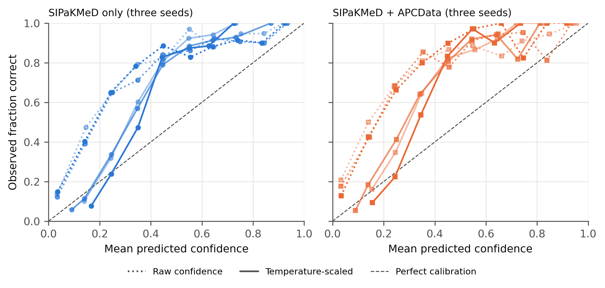

# Supplementary material

Hidden field overlap, incomplete reference annotation and label conversion errors in cervical-cell detection: a retrospective multi-source study with external evaluation

Abu Suraih Sakhri (abusuraihsakhri@gmail.com)

\pagebreak

## S1. Errors in earlier internal analyses and their corrections

An internal audit (19 September 2026) and a subsequent release verification examined the code, data, checkpoints and reports of our earlier analysis. Results from that analysis are withdrawn. Each error below is listed with its evidence, its effect and the correction used in the present study. Historical files are archived unchanged in `results/archive_before_corrections_20260919/`.

**Supplementary Table S1.** Errors found in the earlier analysis.

| No. | Error | Evidence and effect | Correction |
|---|---|---|---|
| 1 | Five-class baseline scored with assumed class indices. The evaluators treated indices 2 and 3 (metaplastic, parabasal) as abnormal; the checkpoint's indices 0 and 1 are dyskeratotic and koilocytotic. | On the 40 dense fields at confidence 0.04, the saved result gave 14/361 abnormal cells detected (recall 3.9%, precision 5.2%). Name-based mapping gives 166/361 (recall 46.0%, precision 59.5%). A summary table in the earlier session log reported different values again (recall 2.8%, precision 67.6%) that match no saved result. The baseline's disadvantage was greatly overstated. | Shared name-based taxonomy module; numeric indices are never assumed. Regression tests. |
| 2 | Dense-set evaluator passed a five-class model and binary labels into one confusion matrix without remapping. | Per-class baseline metrics were meaningless. | Binary mapping by name before matching. |
| 3 | Label Studio importer fell back to model predictions when a task had no human annotation, labelled such images "verified", mapped unknown labels to Normal and skipped missing images. | Model output could silently become reference truth. | Importer fails on unannotated tasks, unknown or ambiguous labels, invalid geometry, duplicate or missing images, and missing reviewer metadata. |
| 4 | Train/validation split built per file by first-listed class. | Filename coordinates showed 206 overlapping train/validation rectangle pairs involving 45 validation tiles, 8 of them dense fields. | Superseded by overlap-component grouping (item 5). |
| 5 | The first corrected split (v2) grouped fields by filename only. | Release verification found re-captured fields under different identifiers crossing splits. For example, dense evaluation field koil_0061 and training field koil_0062 show the same field at two focus settings (pixel correlation 0.995). Under the final overlap rule, 148 confirmed overlapping pairs crossed v2 partitions. Ten of the 20 v2 dense evaluation fields overlapped a field elsewhere: 12 pairs with training fields, 1 with test, 1 with validation and 1 with a dense development field. v2 training was stopped and its models are not reported. | Image-overlap detection (Methods; Section S2) and connected-component splits (v3). |
| 6 | Operating threshold chosen from 65 candidates and reported on the same 40 fields. | Reported performance was optimistic. | Frozen component-level development/evaluation split of the dense fields. |
| 7 | Calibration gradient multiplied the binary NLL derivative by an extra factor; temperature was fitted and scored on the same records. | The fitted temperature did not minimize the stated objective; ECE change was in-sample. | Exact NLL minimization over log-temperature; fit on development, score on evaluation. |
| 8 | HMCHH conversion assumed one category after sampling 200 files. | In the validation fields it labelled 218 Trichomonas, 111 shift-in-flora and 3 Actinomyces boxes as abnormal cells (332 of 2,054 reference boxes, 16.2%), and it dropped 114 abnormal-cell polygons and 5 point annotations. All earlier HMCHH results used this reference. | Reference rebuilt from XML, abnormal cells only, polygons included (Methods). |
| 9 | HMCHH evaluation used the first 500 sorted images. | Not a prespecified or slide-balanced sample. | All validation fields; slide-prefix clustered intervals. |
| 10 | Removing predictions labelled Normal on HMCHH was described as proof that 80% of false alarms were correctly identified normal cells. | HMCHH has no normal-cell reference, so model labels were treated as truth. Filtering also removed matches to abnormal cells (348 → 200). | Claim withdrawn. |
| 11 | All retained training runs used seed 0; a "±0.03 noise floor" was asserted. | No seed variation was measured. | Three explicit seeds; mean, SD and range reported; no noise floor asserted. |
| 12 | Stain benchmark declared "significant improvement" when recall rose by more than 0.03. | Not a statistical test; one reference image set; mechanism claims ("morphological stain invariance") unsupported. | Three reference sets; paired cluster-bootstrap intervals; descriptive wording. |
| 13 | Cross-dataset script subtracted a published classification accuracy (91%) from detector diagonals across incompatible vocabularies. | Deltas were not interpretable. | Removed. The publication is cited as context only. |
| 14 | Documentation errors: initialization described as ImageNet-pretrained; early stopping described as monitoring mAP50; `half` described as the mixed-precision control; any CUDA error treated as out-of-memory; output directory reconstructed rather than read from the trainer. | Misreported methods; possible misidentified runs. | Corrected: COCO-pretrained detection checkpoint; fitness is mAP50-95 in the installed version; `amp=True`; OOM detection by message; trainer `save_dir` recorded. |
| 15 | Mirror dataset described as original SIPaKMeD. | The derivative contains 1,298 fields versus 966 source cluster images, with coordinate-named crops. | Described as a derivative; unresolved-provenance fields excluded from training. |

## S2. Field-overlap detection: calibration and results

**Discovery.** A perceptual-hash screen of the v2 split flagged one pair at Hamming distance 0: dense evaluation field koil_0061 and training field koil_0062. Pixel correlation was 0.995; the images show one field at two focus settings. A shift-tolerant correlation screen then surfaced further cross-split pairs. Visual inspection of six pairs with shift-tolerant correlation between 0.84 and 0.96 showed that all six were the same field, shifted or refocused, sometimes filed under different class prefixes.

**Calibration.** Seven visually confirmed overlaps produced 26 to 1,768 RANSAC inliers with inlier ratios of at least 0.89. Sixty random pairs produced at most 17 inliers, with ratios of at most 0.55. We set the rule at ≥ 20 inliers and ratio ≥ 0.70. A first full run (screen 0.45) confirmed 388 pairs, including 12 between SIPaKMeD and APCData. Those 12 were visually unrelated fields. In every one of them the fitted similarity transform had scale near 0, a degenerate fit to static artifacts shared by the two images, whereas all confirmed true overlaps had scale near 1.0. Across the 388 pairs, scale was bimodal: 137 near 0 and 251 between 0.9 and 1.1, with none in between. Adding the constraint 0.8 ≤ scale ≤ 1.25 removed all cross-source pairs. The six lowest-correlation pairs that remained (correlation 0.45, and 20–22 inliers) were all true overlaps on inspection. Because true overlaps occurred at the 0.45 screening boundary, the final run lowered the screen to 0.35. Pair lists with scores are released in `reproducibility/overlap_calibration/`. The visual montages used for inspection contain dataset images and are not redistributed; they can be regenerated from the pair lists.

**Final run.** Because true partial overlaps kept appearing at the lower bound of each correlation screen (a screen at 0.35 still added 50 new component merges in its lowest band), the final run matched every within-source pair exhaustively: 1,019,514 pairs among 1,715 fields. Cross-source pairs were matched only above correlation 0.35. The run confirmed 791 overlapping pairs (783 within SIPaKMeD, 8 within APCData, none across sources). Of these, 421 had thumbnail correlation below 0.35 and would have been missed by any of the screens.

**Photometric verification.** For every confirmed pair, the second field was warped onto the first with the fitted transform, and normalized cross-correlation was computed inside the shared region. For 790 of 791 pairs, the correlation exceeded 0.94 (minimum 0.945; 5th percentile 0.988), so the pixels themselves agree and not just the keypoints. The remaining pair gave a degenerate reverse fit, but its filename coordinates show a 420 × 611 px overlap; both fields were excluded from training as unresolved provenance.

**Effect on grouping.** Joining filename groups with the 791 overlaps merged 199 filename groups, leaving 840 components: 759 SIPaKMeD and 81 APCData, 187 with more than one field, the largest with 29 fields. Sixty-one SIPaKMeD fields fall in components containing a dense field and were withheld from all training (the 32 canonical dense fields and 29 others). Under this evidence, the superseded v2 split had 148 overlapping pairs crossing partitions. Ten of its 20 dense evaluation fields overlapped a field in another partition, 12 of those pairs with training fields.

## S3. Dense reference annotation

**Sampling.** Forty fields were drawn with seed 0 from the validation partition of the SIPaKMeD derivative. That partition predates this study, and the historical models were selected on it; this is one reason the dense fields were withheld from all training in the present study.

**Proposals.** An earlier combined-source detector produced 541 proposals at confidence 0.05 on the 40 fields. The 197 sparse public boxes on the same fields were shown alongside them.

**Task.** Label Studio, two rectangle labels (Normal, Abnormal). Instructions: correct class and box for every proposal, delete false proposals, and add every missed squamous cell.

**Outcome.** The export (SHA-256 `138363b7…c9f`) contains 1,067 boxes: 706 normal and 361 abnormal. By Label Studio origin field, 688 boxes are unmodified predictions, 33 are modified predictions and 346 were drawn manually. Compared by value with the proposals, 689 boxes are unchanged, 32 changed, 346 added and 17 removed. The two counts measure different properties and are both reported.

**Provenance limits.** The export records no reviewer identity, completion timestamp or adjudication trail. Review of all 40 fields, including a search for missed cells, was attested by the reviewer after the audit (`results/annotation_attestation_20260919.json`). There was no second independent reviewer, and reviewer credentials are not recorded. An unmodified proposal (origin "prediction") may have been checked and accepted, or not checked; the export cannot tell these apart. Because proposals came from a model related to those evaluated, the reference may favor model-like detections. The dense reference is therefore more complete than the public labels, but it is not an expert gold standard, and we recommend independent re-annotation before any clinical use of these numbers.

## S4. Per-seed results, calibration and stain analysis

**Supplementary Table S2.** Held-out test sets with sparse (incomplete) labels. Precision counts detections of unannotated cells as errors and is a lower bound.

| Evaluation | Training data | Seed | Fields | Abnormal TP/reference | Abnormal recall % (95% CI) | Abnormal precision % (lower bound; 95% CI) | Localization recall % (95% CI) |
|---|---|---|---|---|---|---|---|
| SIPaKMeD held-out test | SIPaKMeD only | 17 | 140 | 230/277 | 83.0 (76.4–88.5) | 16.5 (10.9–24.3) | 90.4 (86.8–93.4) |
| SIPaKMeD held-out test | SIPaKMeD only | 43 | 140 | 218/277 | 78.7 (71.4–85.1) | 20.6 (14.2–29.2) | 86.6 (82.5–90.4) |
| SIPaKMeD held-out test | SIPaKMeD only | 101 | 140 | 214/277 | 77.3 (69.2–84.7) | 14.5 (9.0–22.8) | 86.9 (82.3–91.3) |
| SIPaKMeD held-out test | SIPaKMeD + APCData | 17 | 140 | 223/277 | 80.5 (73.8–86.1) | 21.7 (15.6–29.3) | 88.2 (84.1–91.5) |
| SIPaKMeD held-out test | SIPaKMeD + APCData | 43 | 140 | 192/277 | 69.3 (64.0–77.0) | 28.7 (19.8–39.9) | 81.9 (78.2–86.2) |
| SIPaKMeD held-out test | SIPaKMeD + APCData | 101 | 140 | 213/277 | 76.9 (65.5–85.1) | 19.4 (11.8–28.8) | 89.0 (82.8–93.6) |
| APCData held-out test | SIPaKMeD only | 17 | 45 | 40/174 | 23.0 (7.6–32.8) | 33.3 (11.4–51.7) | 39.7 (30.5–51.9) |
| APCData held-out test | SIPaKMeD only | 43 | 45 | 24/174 | 13.8 (5.0–20.3) | 34.8 (16.3–43.9) | 28.9 (22.4–32.5) |
| APCData held-out test | SIPaKMeD only | 101 | 45 | 26/174 | 14.9 (7.2–21.2) | 36.1 (17.6–60.3) | 27.3 (23.9–29.5) |
| APCData held-out test | SIPaKMeD + APCData | 17 | 45 | 135/174 | 77.6 (73.1–90.1) | 25.8 (12.3–37.8) | 84.9 (78.4–93.5) |
| APCData held-out test | SIPaKMeD + APCData | 43 | 45 | 117/174 | 67.2 (58.8–85.1) | 37.4 (20.5–50.6) | 77.0 (68.8–87.6) |
| APCData held-out test | SIPaKMeD + APCData | 101 | 45 | 128/174 | 73.6 (66.2–90.9) | 26.7 (13.7–37.5) | 87.3 (78.5–96.7) |

**Supplementary Table S3.** The same predictions on the 20 dense evaluation fields scored against the public sparse labels and against the dense reference (post hoc).

| Training data | Seed | Reference | Reference cells | Abnormal reference cells | Localization precision % | Localization recall % | Abnormal precision % | Abnormal recall % |
|---|---|---|---|---|---|---|---|---|
| SIPaKMeD only | 17 | sparse | 117 | 51 | 20.1 | 90.6 | 24.7 | 86.3 |
| SIPaKMeD only | 17 | dense | 582 | 224 | 63.9 | 57.9 | 64.6 | 51.3 |
| SIPaKMeD only | 43 | sparse | 117 | 51 | 27.4 | 87.2 | 29.6 | 78.4 |
| SIPaKMeD only | 43 | dense | 582 | 224 | 74.7 | 47.8 | 68.9 | 41.5 |
| SIPaKMeD only | 101 | sparse | 117 | 51 | 25.4 | 87.2 | 26.0 | 86.3 |
| SIPaKMeD only | 101 | dense | 582 | 224 | 76.1 | 52.6 | 63.9 | 48.2 |
| SIPaKMeD + APCData | 17 | sparse | 117 | 51 | 23.3 | 92.3 | 28.8 | 82.4 |
| SIPaKMeD + APCData | 17 | dense | 582 | 224 | 67.5 | 53.8 | 67.8 | 44.2 |
| SIPaKMeD + APCData | 43 | sparse | 117 | 51 | 34.6 | 77.8 | 45.7 | 62.7 |
| SIPaKMeD + APCData | 43 | dense | 582 | 224 | 85.2 | 38.5 | 87.1 | 27.2 |
| SIPaKMeD + APCData | 101 | sparse | 117 | 51 | 15.9 | 88.9 | 20.4 | 76.5 |
| SIPaKMeD + APCData | 101 | dense | 582 | 224 | 53.2 | 59.8 | 52.4 | 44.6 |

**Supplementary Table S4.** Calibration of emitted detections on the dense evaluation fields, before and after temperature scaling fitted on the development fields.

| Training data | Seed | Temperature | Predictions | ECE raw | ECE scaled | Brier raw | Brier scaled | NLL raw | NLL scaled |
|---|---|---|---|---|---|---|---|---|---|
| SIPaKMeD only | 17 | 2.523 | 1035 | 0.193 | 0.129 | 0.195 | 0.174 | 0.616 | 0.523 |
| SIPaKMeD only | 43 | 1.912 | 1165 | 0.167 | 0.113 | 0.174 | 0.158 | 0.553 | 0.481 |
| SIPaKMeD only | 101 | 2.102 | 1028 | 0.189 | 0.131 | 0.184 | 0.164 | 0.591 | 0.499 |
| SIPaKMeD + APCData | 17 | 2.337 | 1195 | 0.184 | 0.125 | 0.180 | 0.161 | 0.579 | 0.492 |
| SIPaKMeD + APCData | 43 | 1.885 | 979 | 0.212 | 0.140 | 0.208 | 0.183 | 0.670 | 0.543 |
| SIPaKMeD + APCData | 101 | 2.278 | 861 | 0.233 | 0.127 | 0.228 | 0.194 | 0.752 | 0.571 |

**Supplementary Table S6.** Variation across the three training seeds (mean, sample SD, minimum and maximum).

| Training data | Evaluation | Metric | Mean | SD | Min | Max |
|---|---|---|---|---|---|---|
| SIPaKMeD only | dense_evaluation | abnormal_recall | 0.470 | 0.050 | 0.415 | 0.513 |
| SIPaKMeD only | dense_evaluation | abnormal_precision | 0.658 | 0.027 | 0.639 | 0.689 |
| SIPaKMeD only | dense_evaluation | abnormal_f1 | 0.547 | 0.027 | 0.518 | 0.572 |
| SIPaKMeD only | hmchh | abnormal_recall | 0.449 | 0.083 | 0.357 | 0.518 |
| SIPaKMeD only | hmchh | abnormal_precision | 0.042 | 0.002 | 0.039 | 0.043 |
| SIPaKMeD only | hmchh | abnormal_f1 | 0.076 | 0.005 | 0.070 | 0.079 |
| SIPaKMeD + APCData | dense_evaluation | abnormal_recall | 0.387 | 0.099 | 0.272 | 0.446 |
| SIPaKMeD + APCData | dense_evaluation | abnormal_precision | 0.691 | 0.174 | 0.524 | 0.871 |
| SIPaKMeD + APCData | dense_evaluation | abnormal_f1 | 0.477 | 0.060 | 0.415 | 0.535 |
| SIPaKMeD + APCData | hmchh | abnormal_recall | 0.319 | 0.101 | 0.208 | 0.405 |
| SIPaKMeD + APCData | hmchh | abnormal_precision | 0.054 | 0.014 | 0.038 | 0.067 |
| SIPaKMeD + APCData | hmchh | abnormal_f1 | 0.090 | 0.021 | 0.070 | 0.112 |

**Supplementary Table S7.** Paired change (normalized minus raw) in abnormal-cell recall and precision under Reinhard normalization, for each model, dataset and reference set, with 95% cluster-bootstrap intervals.

| Model | Dataset | Reference set | Δ abnormal recall pp (95% CI) | Δ abnormal precision pp (95% CI) |
|---|---|---|---|---|
| v3_sipakmed_only_seed17 | dense_evaluation | 0 | −9.4 (−18.7 to 0.6) | −2.8 (−13.6 to 3.6) |
| v3_sipakmed_only_seed17 | dense_evaluation | 1 | −11.2 (−18.9 to −1.7) | −1.7 (−12.6 to 6.7) |
| v3_sipakmed_only_seed17 | dense_evaluation | 2 | −12.1 (−21.1 to −2.0) | −2.2 (−16.4 to 7.5) |
| v3_sipakmed_only_seed17 | apc_sparse_test | 0 | −8.6 (−18.2 to 16.7) | −12.5 (−28.1 to 12.0) |
| v3_sipakmed_only_seed17 | apc_sparse_test | 1 | −8.0 (−17.2 to 16.7) | −12.7 (−26.4 to 9.9) |
| v3_sipakmed_only_seed17 | apc_sparse_test | 2 | −8.0 (−18.5 to 18.8) | −11.1 (−25.7 to 13.8) |
| v3_combined_seed17 | dense_evaluation | 0 | −15.2 (−22.2 to −0.9) | −7.1 (−31.3 to 8.0) |
| v3_combined_seed17 | dense_evaluation | 1 | −16.5 (−23.3 to −3.1) | −7.6 (−33.1 to 8.0) |
| v3_combined_seed17 | dense_evaluation | 2 | −19.2 (−26.6 to −5.4) | −10.7 (−36.6 to 4.8) |
| v3_combined_seed17 | apc_sparse_test | 0 | −36.2 (−49.3 to −20.4) | 4.1 (−0.1 to 7.9) |
| v3_combined_seed17 | apc_sparse_test | 1 | −35.1 (−46.6 to −20.4) | 5.7 (0.6–10.8) |
| v3_combined_seed17 | apc_sparse_test | 2 | −42.5 (−57.0 to −27.0) | 4.9 (−1.4 to 12.0) |
| v3_sipakmed_only_seed43 | dense_evaluation | 0 | −8.5 (−18.3 to 6.0) | −1.6 (−20.3 to 11.6) |
| v3_sipakmed_only_seed43 | dense_evaluation | 1 | −10.7 (−21.0 to 2.2) | −0.6 (−19.9 to 12.0) |
| v3_sipakmed_only_seed43 | dense_evaluation | 2 | −12.9 (−22.8 to 0.0) | −2.2 (−21.9 to 11.8) |
| v3_sipakmed_only_seed43 | apc_sparse_test | 0 | −1.7 (−10.0 to 23.7) | −16.0 (−24.6 to 3.2) |
| v3_sipakmed_only_seed43 | apc_sparse_test | 1 | −1.1 (−10.0 to 26.0) | −14.4 (−23.8 to 5.9) |
| v3_sipakmed_only_seed43 | apc_sparse_test | 2 | −3.4 (−10.4 to 18.9) | −16.0 (−24.5 to 3.0) |
| v3_combined_seed43 | dense_evaluation | 0 | −6.7 (−9.6 to −0.7) | −17.4 (−36.1 to −7.3) |
| v3_combined_seed43 | dense_evaluation | 1 | −6.7 (−9.6 to −0.8) | −14.1 (−32.2 to −4.1) |
| v3_combined_seed43 | dense_evaluation | 2 | −9.4 (−11.5 to −5.1) | −14.4 (−32.9 to −3.7) |
| v3_combined_seed43 | apc_sparse_test | 0 | −40.2 (−57.3 to −28.9) | 0.8 (−4.1 to 6.9) |
| v3_combined_seed43 | apc_sparse_test | 1 | −39.7 (−56.5 to −28.9) | 2.0 (−3.2 to 7.8) |
| v3_combined_seed43 | apc_sparse_test | 2 | −43.1 (−62.0 to −34.0) | 1.9 (−3.4 to 8.3) |
| v3_sipakmed_only_seed101 | dense_evaluation | 0 | −8.5 (−17.0 to 1.8) | −6.9 (−18.1 to 2.6) |
| v3_sipakmed_only_seed101 | dense_evaluation | 1 | −8.9 (−16.6 to 1.8) | −1.9 (−13.6 to 10.3) |
| v3_sipakmed_only_seed101 | dense_evaluation | 2 | −10.7 (−20.9 to 1.8) | −3.9 (−16.9 to 7.1) |
| v3_sipakmed_only_seed101 | apc_sparse_test | 0 | 0.6 (−6.5 to 16.7) | −19.3 (−35.5 to 0.3) |
| v3_sipakmed_only_seed101 | apc_sparse_test | 1 | 0.6 (−6.9 to 14.9) | −19.1 (−33.7 to −1.2) |
| v3_sipakmed_only_seed101 | apc_sparse_test | 2 | −1.7 (−6.0 to 8.8) | −21.3 (−36.1 to −5.5) |
| v3_combined_seed101 | dense_evaluation | 0 | −9.4 (−18.0 to 9.8) | −7.7 (−13.5 to 0.8) |
| v3_combined_seed101 | dense_evaluation | 1 | −9.8 (−18.7 to 9.2) | −8.3 (−12.9 to 0.3) |
| v3_combined_seed101 | dense_evaluation | 2 | −13.8 (−23.3 to 7.1) | −9.0 (−13.6 to 2.4) |
| v3_combined_seed101 | apc_sparse_test | 0 | −52.3 (−74.5 to −41.9) | 2.5 (−4.3 to 11.1) |
| v3_combined_seed101 | apc_sparse_test | 1 | −50.0 (−71.9 to −39.6) | 3.3 (−3.2 to 11.5) |
| v3_combined_seed101 | apc_sparse_test | 2 | −53.4 (−78.2 to −43.4) | 4.0 (−5.0 to 14.0) |

## S5. Reporting checklist (TRIPOD+AI and CLAIM 2024 items applicable to this study)

The checklist lists the items that apply to a retrospective detection study on public images, with where each is addressed. Items specific to prospective data collection, patient-level outcomes or deployment are marked not applicable, with the reason.

| Topic | Where addressed |
|---|---|
| Title identifies the study as developing and evaluating an AI model, with the target task | Title |
| Structured abstract with objective, data, methods, results and limitations | Abstract |
| Clinical context and rationale; intended use not claimed | Introduction, final paragraph; Discussion, limitations |
| Study objectives and hypotheses | Introduction, final paragraph |
| Data sources, dates, and dataset versions | Methods, Data sources; Reference 5 (APCData V1), Reference 7 (HMCHH DOI) |
| Eligibility and exclusion of images with reasons and counts | Methods, Data sources; Table 1 |
| Preprocessing and label conversion, including category mapping | Methods, Data sources and Reference standards; Section S1 items 1, 8 |
| Reference standard definition, annotators, instructions, and blinding | Methods, Reference standards; Section S3 |
| Inter-annotator agreement | Not available: one reviewer; stated as a limitation |
| Handling of missing annotation and point-only labels | Methods, HMCHH external reference |
| Data partitioning and unit of independence | Methods, Detection of overlapping fields and split construction; Section S2 |
| Leakage prevention and verification | Methods; Section S2; `publication/reproducibility/release_verification.json` |
| Model architecture, initialization, software and hardware versions | Methods, Models and training |
| Training procedure, hyperparameters, augmentation, stopping, and model selection | Methods, Models and training; released `args.yaml` for every run |
| Random seeds and repeated runs | Methods (three seeds); Table 3, Section S4 |
| Operating threshold selection on data separate from evaluation | Methods, Evaluation |
| Performance metrics with definitions and matching rule | Methods, Evaluation |
| Uncertainty estimation and clustering | Methods, Statistical analysis |
| Calibration | Methods, Calibration; Section S4 |
| External evaluation on data from a different source | Methods and Results (HMCHH) |
| Subgroup or fairness analysis by patient characteristics | Not applicable: no patient-level metadata in the public sources |
| Failure analysis and error burden | Results (missed abnormal cells, false detections per field) |
| Sample size justification | Not formally powered; retrospective use of all eligible public data; stated as a limitation |
| Protocol preregistration | Hash-locked internal protocol before training; not publicly preregistered |
| Code, weights and data availability | Declarations; delivery package |
| Deviations from protocol | Results and Section S1 (v2 superseded; post hoc completeness analysis labelled) |
| Limitations, generalizability and intended use | Discussion |
| Funding, conflicts, and use of AI tools | Declarations |
